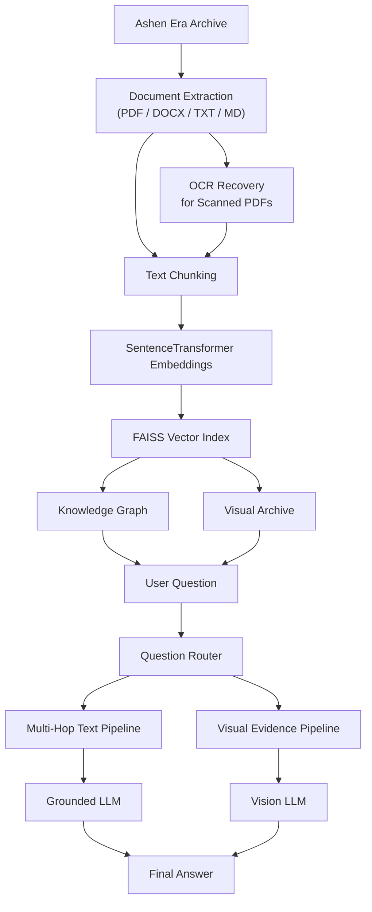

# Ashen Era Archive Assistant

An intelligent document assistant developed by **Team ByteKnights** for **CodeFest 2026**.

The system is designed to answer questions across the fictional **Ashen Era Archive**, including questions that require connecting information across multiple documents and questions whose answers are contained in visual evidence.

## Selected Sub-Track

### Track 1B – Connecting Facts Across Thousands of Pages

Our primary focus is multi-document and multi-hop reasoning.

Instead of relying only on standard vector similarity search, ByteKnights combines:

- Semantic vector retrieval
- Entity-aware reranking
- Knowledge-graph expansion
- LLM-generated second-hop searches
- Evidence fusion
- Grounded answer generation

The system also contains a visual evidence pipeline as an additional capability for questions involving figure plates, portraits, banners, illustrations, and other archive images.

---

# System Overview

ByteKnights processes the Ashen Era Archive through the following pipeline:



# Text Multi-Hop RAG Pipeline

For text-based questions, ByteKnights performs the following stages:

1. Convert the user question into an embedding.
2. Retrieve candidate chunks using FAISS.
3. Apply entity-aware reranking.
4. Filter, deduplicate, and diversify retrieved sources.
5. Detect known entities from the question or retrieved evidence.
6. Expand related entities using the knowledge graph.
7. Rank graph neighbors according to relevance to the original question.
8. Perform graph-guided retrieval.
9. Use an LLM to generate targeted second-hop search queries.
10. Perform second-hop retrieval.
11. Fuse evidence from first-hop, graph-guided, and second-hop retrieval.
12. Generate a final answer using only the retrieved archive evidence.

This approach is designed for questions where the answer cannot necessarily be found in a single document.

Example reasoning chain:

```text
Person
  ↓
Organization / Faction
  ↓
Conflict / Accord
  ↓
Answer
```

---

# Knowledge Graph

A lightweight knowledge graph is automatically constructed from the Markdown wiki documents in the archive.

The graph extracts:

- Standard Markdown links
- Wiki-style entity links
- Entity-to-entity references

Current development graph:

```text
Nodes: 166
Edges: 348
```

The graph is used as a retrieval-expansion mechanism.

Graph edges represent **document/entity references**, not guaranteed semantic relationship types.

---

# Visual Evidence Pipeline

ByteKnights can automatically identify questions requiring visual evidence.

Examples include questions involving:

- Figure plates
- Portraits
- Banners
- Emblems
- Illustrations
- Objects shown in images
- Visual numerical information

The visual pipeline:

```text
Question
   ↓
Visual Intent Detection
   ↓
Archive Image Matching
   ↓
Candidate Ranking
   ↓
Selected Archive Image
   ↓
Vision Model
   ↓
Grounded Visual Answer
```

The original archive image used as evidence is also displayed in the Streamlit interface.

The visual model is instructed to answer using only information visibly present in the selected archive image.

---

# OCR Support

Some archive PDFs contain scanned pages with no directly extractable text.

ByteKnights includes an OCR recovery stage using:

- PyMuPDF
- Tesseract OCR
- Pillow
- pytesseract

During development:

```text
Initially empty records: 35
OCR recovered: 35
Remaining empty records: 0
```

This allows scanned archive material to participate in downstream retrieval.

---

# Corpus Processing

During development, the ingestion pipeline processed:

```text
Files processed: 255
Extracted records: 1,440
Characters extracted: 5,053,589
```

After OCR recovery and chunking:

```text
Chunks: 2,487
Maximum chunk size: 500 words
Chunk overlap: 100 words
Average chunk size: approximately 381.81 words
```

PNG images are handled separately by the visual evidence pipeline.

---

# Embeddings and Vector Search

ByteKnights uses:

```text
Embedding model:
sentence-transformers/all-MiniLM-L6-v2
```

Embedding dimension:

```text
384
```

Vector retrieval uses:

```text
FAISS IndexFlatIP
```

Embeddings are normalized before indexing, allowing inner-product search to operate as cosine-style similarity search.

---

# LLM Integration

ByteKnights uses OpenRouter-compatible models through the OpenAI Python client.

Text answer generation uses:

```text
openai/gpt-4o-mini
```

Visual archive analysis uses:

```text
google/gemini-2.5-flash
```

API keys are loaded through environment variables and are **not committed to the repository**.

---

# User Interface

A Streamlit interface is provided for demonstrating and using the system.

The UI automatically routes questions to the appropriate pipeline.

For text questions it displays:

- Final answer
- Pipeline used
- Evidence documents
- Page numbers when available
- Retrieval scores
- Retrieved evidence text

For visual questions it displays:

- Final answer
- Visual pipeline indicator
- Original archive image used as evidence

---

# Installation

## 1. Clone the repository

```bash
git clone https://github.com/Nimna-jayasinha/CodeFest2026.git
cd ByteKnights
```

## 2. Create a virtual environment

Windows:

```powershell
python -m venv .venv
.\.venv\Scripts\Activate.ps1
```

If PowerShell prevents script execution:

```powershell
Set-ExecutionPolicy -Scope Process -ExecutionPolicy Bypass
.\.venv\Scripts\Activate.ps1
```

## 3. Install dependencies

```bash
pip install -r requirements.txt
```

## 4. Configure environment variables

Create:

```text
.env
```

Add:

```text
OPENROUTER_API_KEY=your_openrouter_api_key
```

Never commit the real `.env` file.

---

# Corpus Location

The Ashen Era Archive is treated as read-only source material.

The development configuration expects the corpus at:

```text
H:\Codefest2026\Ashen_Era_Archive
```

If the archive is stored elsewhere, update the configured archive path before running corpus-dependent scripts.

The original corpus should not be modified by the processing pipeline.

---

# Building the Retrieval System

The main processing stages are:

## 1. Extract documents

```bash
python src/ingest.py
```

Output:

```text
data/processed/documents.jsonl
```

## 2. Recover scanned PDFs using OCR

```bash
python src/ocr_scans.py
```

Output:

```text
data/processed/documents_with_ocr.jsonl
```

## 3. Chunk documents

```bash
python src/chunk_documents.py
```

Output:

```text
data/processed/chunks.jsonl
```

## 4. Build FAISS index

```bash
python src/build_index.py
```

Generated index files are stored under:

```text
data/index/
```

## 5. Build knowledge graph

```bash
python src/build_graph.py
```

Generated graph:

```text
data/graph/knowledge_graph.pkl
```

---

# Running ByteKnights

## Command-Line Interface

```bash
python src/rag_graph_v4.py
```

Then enter an archive question.

Example:

```text
In which year was the 'Gauntlet of Sorrowfell' actually forged?
```

Example answer:

```text
391 AS
```

## Streamlit Interface

Recommended command:

```bash
streamlit run src/app.py --server.fileWatcherType none
```

Then open the local address displayed by Streamlit.

---

# Development Evaluation

The system was manually evaluated against all **20 provided development questions**.

| Track | Passed | Tested | Observed Result |
|---|---:|---:|---:|
| Track 1A – Visual / Rich Evidence | 11 | 11 | 100% |
| **Track 1B – Multi-Hop (Primary)** | **7** | **7** | **100%** |
| Track 1C – Iterative Search | 2 | 2 | 100% |
| **Overall** | **20** | **20** | **100%** |

ByteKnights successfully answered all 20 provided development questions during our manual evaluation, including all seven questions from the team's primary Track 1B.

These results describe performance on the **provided development set only** and do not imply 100% accuracy on unseen evaluation questions.

---

# Example Multi-Hop Questions

Examples successfully handled during development include:

```text
Which accord was ultimately won by the faction of which
Ederon Fellgard is a member?
```

Reasoning requires connecting:

```text
Ederon Fellgard
      ↓
Iron-Ring Cartel
      ↓
Leaden Accord
```

Another example:

```text
Which individual was a member of the faction that ultimately
won the War of Drowned Light?
```

This requires discovering the winning faction and then identifying an explicit member of that organization.

---

# Example Visual Question

```text
According to the figure plate illustrating Emberdeep's forces,
what is the recorded total of its garrison strength?
```

The system:

```text
Detects visual intent
        ↓
Retrieves the Emberdeep figure plate
        ↓
Passes the archive image to the vision model
        ↓
Returns: 1,114
        ↓
Displays the source image
```

---

# Project Structure

```text
ByteKnights/
│
├── .git/
├── README.md
├── requirements.txt
│
├── src/
│   ├── app.py
│   ├── ingest.py
│   ├── ocr_scans.py
│   ├── chunk_documents.py
│   ├── build_index.py
│   ├── build_graph.py
│   ├── search_archive.py
│   ├── search_graph.py
│   ├── rag.py
│   ├── rag_graph_v4.py
│   ├── visual_rag.py
│   └── ...
│
├── data/
│   ├── processed/
│   ├── index/
│   └── graph/
│
├── docs/
│   └── diagrams/
│
├── ai_usage/
│
└── configuration-example/
```

---

# Key Engineering Decisions

### FAISS candidate expansion

The system retrieves more initial candidates than the final requested result count. This gives the entity-aware reranker an opportunity to rescue highly relevant documents that semantic retrieval alone ranked slightly lower.

### Entity-aware reranking

Documents directly associated with entities named in the question receive additional relevance weighting.

### Source diversification

Evidence is limited per source to reduce the chance that one document dominates the final context.

### Knowledge-graph expansion

Graph neighbors are used to discover potentially relevant entities and documents for multi-hop questions.

### Stage-aware evidence fusion

Final evidence is selected from:

- First-hop retrieval
- Graph-guided retrieval
- Second-hop retrieval

This helps preserve evidence from different reasoning stages instead of simply taking the globally highest similarity scores.

### Grounded answer generation

The final LLM is instructed to answer from retrieved archive evidence and preserve exact relationship semantics.

For example:

```text
allied with ≠ member of
associated with ≠ member of
participated in ≠ won
```

This is particularly important for Track 1B questions.

---

# Known Limitations

- Knowledge-graph edges represent references rather than fully typed semantic relationships.
- Some entity aliases and capitalization variants may appear as separate graph nodes.
- LLM-generated follow-up queries can occasionally introduce noisy searches.
- Simple questions may still execute graph and second-hop stages, increasing latency.
- Visual image matching currently uses heuristic filename/entity matching.
- Visual answers depend on the vision model correctly interpreting the selected archive image.
- OCR quality may vary for difficult scans.
- Similar content available in both PDF and DOCX form can create duplicate evidence.
- Retrieval thresholds were tuned using the provided development material and have not been validated against hidden evaluation questions.
- External LLM functionality requires network connectivity and a valid API key.

---

# Security

Secrets are stored in:

```text
.env
```

The `.env` file is excluded through `.gitignore`.

Example configuration should contain placeholders only.

No API key should be committed to Git history.

---

# AI Usage

AI-assisted development was used throughout the project for activities including:

- Architecture discussion
- Debugging
- Code review and refinement
- Retrieval-strategy development
- Prompt engineering
- Evaluation planning
- Documentation assistance

AI-generated suggestions were tested, reviewed, and integrated by the team.

Detailed AI usage information and required conversation records are provided under:

```text
ai_usage/
```

---

# Team

**Team:** ByteKnights  
**Competition:** CodeFest 2026  
**Primary Sub-Track:** 1B – Connecting Facts Across Thousands of Pages

---

# Final Note

ByteKnights demonstrates a hybrid document intelligence architecture combining vector retrieval, entity-aware ranking, knowledge-graph expansion, iterative multi-hop retrieval, OCR recovery, grounded LLM generation, and visual archive analysis.

The primary objective is not simply to retrieve similar text, but to **connect evidence across the archive while preserving the relationships required by the user's question**.
