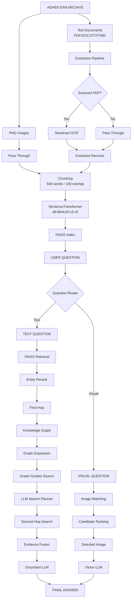
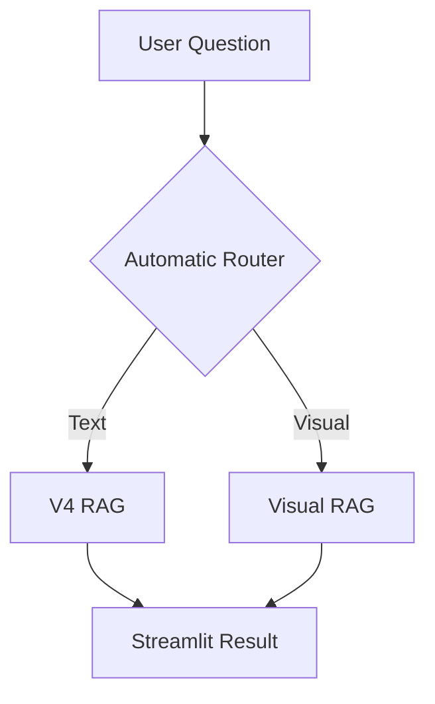

# ByteKnights System Architecture

## 1. Overview

ByteKnights is a hybrid Retrieval-Augmented Generation system developed for the Ashen Era Archive.

The primary target is **Sub-Track 1B – Connecting Facts Across Thousands of Pages**.

The architecture combines semantic retrieval, entity-aware reranking, knowledge-graph expansion, iterative multi-hop retrieval, OCR recovery, visual evidence retrieval, and grounded LLM generation.

## 2. High-Level Architecture



## 3. Document Processing

Supported textual formats include:

- PDF
- DOCX
- Markdown
- TXT

Scanned PDF pages that contain no extractable text are recovered using Tesseract OCR.

The processing pipeline produces normalized JSONL records while preserving source and page metadata.

## 4. Chunking

Extracted records are divided into overlapping chunks.

Development configuration:

- Chunk size: 500 words
- Overlap: 100 words
- Total chunks: 2,487

Metadata such as source, path, type, page and chunk index is preserved.

## 5. Vector Retrieval

Chunks are embedded using:

`sentence-transformers/all-MiniLM-L6-v2`

The normalized 384-dimensional embeddings are stored in a FAISS `IndexFlatIP` index.

The system retrieves an expanded candidate set before reranking so potentially important evidence is not permanently excluded by the initial vector ranking.

## 6. Entity-Aware Reranking

Semantic similarity alone can rank similarly named but incorrect entities highly.

ByteKnights therefore applies entity-aware relevance bonuses when an exact entity occurs in a source name or retrieved text.

The reranked score combines semantic similarity with entity relevance.

## 7. Knowledge Graph

A lightweight knowledge graph is generated from links within the archive's Markdown wiki documents.

Development graph:

- 166 nodes
- 348 edges

The graph is used for retrieval expansion rather than as a complete semantic knowledge base.

Edges represent references between entities/documents and should not automatically be interpreted as typed relationships such as membership or ownership.

## 8. Multi-Hop Retrieval

Text questions pass through several retrieval stages.

### Stage 1 — First-Hop Retrieval

FAISS retrieves semantically relevant candidate chunks, followed by entity-aware reranking, filtering, deduplication and source diversification.

### Stage 2 — Graph Expansion

Known entities are identified from the question.

If necessary, retrieved first-hop evidence is also inspected for graph entities.

Relevant neighboring entities are ranked relative to the original question.

### Stage 3 — Graph-Guided Retrieval

Selected graph neighbors are combined with the original question to produce additional archive searches.

### Stage 4 — LLM Search Planning

An LLM analyzes the question, initial evidence and graph relationships to generate targeted second-hop search queries.

### Stage 5 — Second-Hop Retrieval

The generated queries are searched against the vector index to discover evidence needed to complete the reasoning chain.

### Stage 6 — Evidence Fusion

Evidence is selected across:

- First-hop retrieval
- Graph-guided retrieval
- Second-hop retrieval

Stage-aware quotas help prevent useful multi-hop evidence from disappearing simply because another source has a higher raw similarity score.

## 9. Grounded Answer Generation

The final answer generator receives only the selected archive evidence.

The prompt emphasizes exact relationship semantics.

For example:

```text
allied with != member of
associated with != member of
participated in != won
```

This is particularly important for multi-hop questions where retrieving the correct entities is insufficient unless the relationship between them is also correct.

## 10. Visual Pipeline

Questions containing visual intent are routed separately.

Examples include questions about:

- Figure plates
- Portraits
- Banners
- Emblems
- Illustrations
- Objects shown in an image

The pipeline identifies matching archive PNG files and ranks candidate images.

The selected archive image is sent to a vision-capable model with instructions to answer using only visibly present information.

The selected image is returned to the Streamlit UI as evidence.

## 11. User Interface

The Streamlit interface provides a unified entry point for both pipelines.



For text questions, the UI displays the final answer and expandable evidence sources.

For visual questions, the UI displays the answer and original archive image used as evidence.

## 12. External Services

OpenRouter provides access to the LLMs used for grounded answer generation, search planning and visual analysis.

Secrets are provided through environment variables and are not stored in source control.

## 13. Design Goal

The central design objective is:

> Retrieve not only documents that look similar to the question, but the evidence required to complete the relationship chain behind the question.

This architecture therefore combines dense retrieval with explicit entity structure and iterative retrieval rather than relying on a single vector search.
